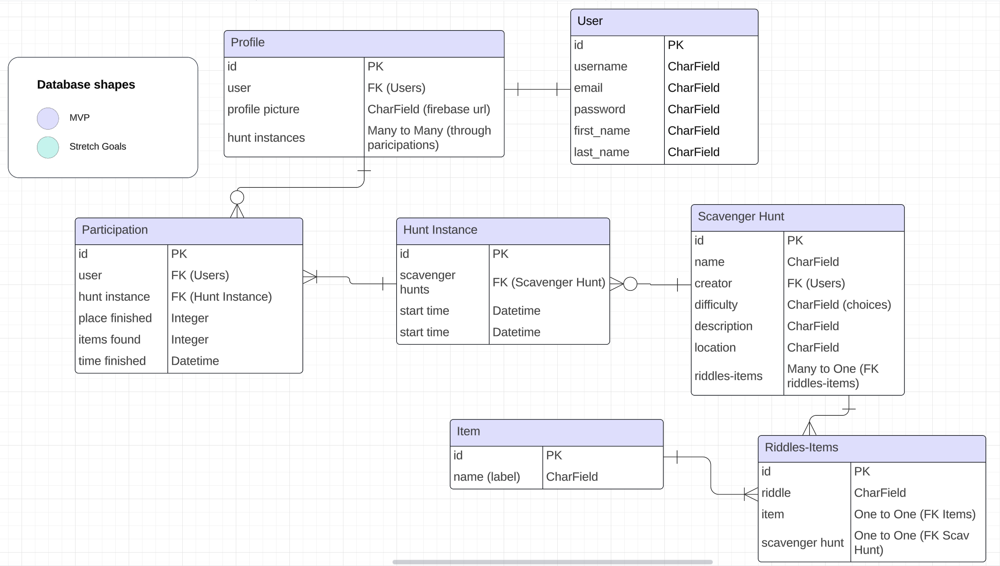
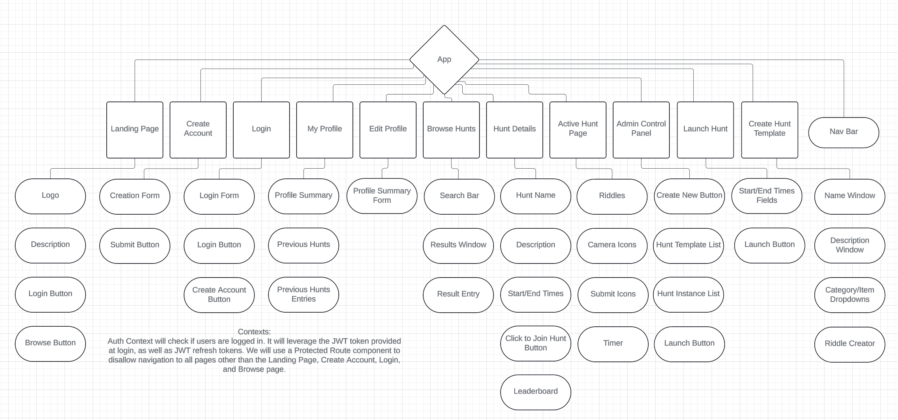
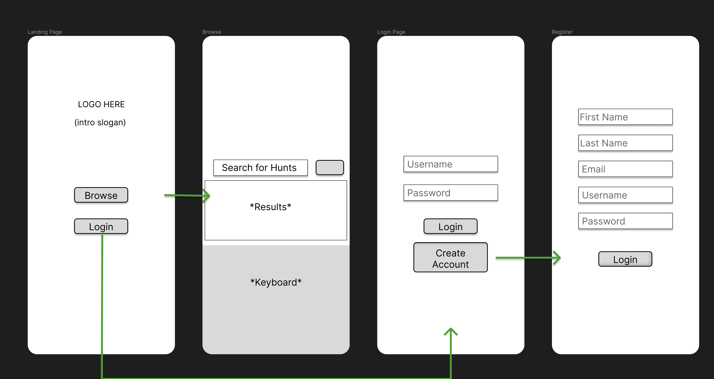
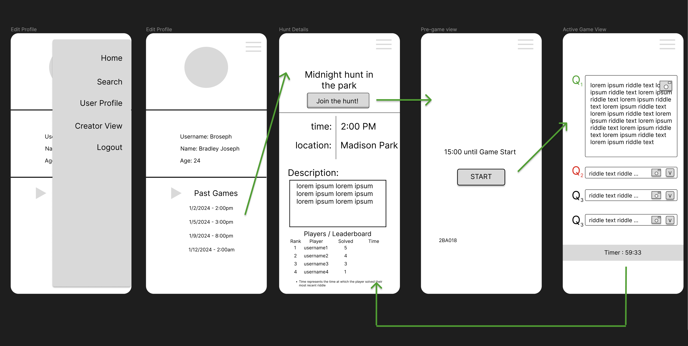
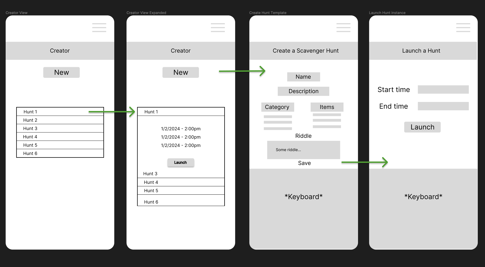

# Riddle Me This API

## Description

"Riddle Me This" is a scavenger hunt application that allows users to create and participate in interactive and challenging scavenger hunts. Creators design scavenger hunts by crafting riddles and specifying the items that participants need to locate. Each riddle corresponds to one item. Participants, using their phones, solve these riddles and upload a picture of what they believe to be the correct answer. Each participant is given a certain amount of time to complete the game. Upon selecting a riddle, participants can upload their answer image directly within the app. If the submitted picture is correct, they receive feedback that their answer is correct; if incorrect, they are prompted to try again. Multiple participants can join a single hunt, and their progress is tracked and displayed on a leaderboard that updates whenever a user refreshes the page. The method for checking if photos are correct is by leveraging OpenCV and machine learning to automatically identify and label the images.

## User Stories

### MVP

* AAU, I would like to be able to log in and make an account.

#### As A Creator 

* AAC, I would like to be able to create my own scavenger hunts.
* AAC, I would like my hunt to be reusable, and launched my an admin panel where I can schedule hunts.
* AAC, I want to be able to pick from a large list of available items.
* AAC, I want to be sure than any items I pick will be recognized by the ML model to compare with user inputs.
* AAC, I want to be able to include a description/narrative for the hunt.
* AAC, I would like to be able to set a start and end time for an instance of the hunt.

#### As A Player

* AAP, I would like fast feedback on whether or not I solved an individual riddle.
* AAP, I would like to be able to track my progress as I complete the hunt.
* AAP, I would like to be able to view a leaderboard, sorted by players that have found the most items at any given time.
* AAP, I would like to have the leaderboard shown to me at the end to show me how I performed.
* AAP, I would like to be able to browse hunts that I can then join.

### Strech Goals

#### As A Creator

* AAC, I want to be able to toggle whether all clues are revealed at the start of the hunt, or clues must be solved successfully.
* AAC, if I toggle the narrative option, I want to be able to include story points as the clues are solved.
* AAC, I would like to see all of the submissions from players for each riddle.
* AAC, I would like to be able to create a template for a hunt that other users can use to run instances of the hunt on their own.
* AAC, I would like to be able to query other riddles that were written in the past for an item I am adding to my hunt.

#### As A Player

* AAP, I would like to be able to have a calendar event provided for me automatically when I join a hunt.
* AAP, I would like my account to keep track of how many hunts I have won and participated in.
* AAP, I would like to have a rank associated with my account based on my participation and wins.
* AAP, I want the leaderboard to prioritize number of items found, and fallback to time completed when there is a tie.
* AAP, I would like to be able to rate a hunt, and view the rating of a hunt in a list view if a rating exists.

## ERD

[View ERD on Lucid](https://lucid.app/lucidchart/3871a75e-1579-45bf-a63f-8b0540fd6184/edit?page=0_0&invitationId=inv_eeedad1e-af4d-49ad-9a76-7d69052bf54a#)

## Component Hierarchy Diagram

[View Component Hierarchy Diagram on Lucid](https://lucid.app/lucidchart/0608d439-ea6f-4d75-adf5-ccd8d7321e6f/edit?invitationId=inv_64e25d18-a172-4b88-ab75-f54fb3590368&page=0_0#)

#### React Routes

<!-- <Routes>
  <Route path='/' element={<Landing />} />
  <Route path='/browse-games' element={<BrowseGames />} />
  <Route path='/my-profile' element={<MyProfile />} />
  <Route path='/edit-profile' element={<EditProfile />} />
  <Route path='/hunt-details/:id' element={<HuntDetails />} />
  <Route path='/active-game/:id' element={<ActiveGame />} />
  <Route path='/creator-view' element={<CreatorView />} />
  <Route path='/create-hunt-template' element={<CreateHuntTemplate />} />
  <Route path='/launch-hunt' element={<LaunchHunt />} />
</Routes> -->

## Wireframes

#### Landing Page/Auth Pages/Browse Page

#### Player User Pages

#### Creator User Pages

## Task Management

[Link to Trello Board](https://trello.com/b/EMyZfZzy/project-4-planning)

## Timeline

| Day       |   | Task                                                                           | Status | Notes |
|-----------|---|--------------------------------------------------------------------------------|--------|-------|
| Friday    |   | Create proposal, make ERD, make CHD, front-end Wireframes, build Models        | To Do  |       |
| Saturday  |   | Create Views, Serializers, Paths, deploy backend on Heroku                     | To Do  |       |
| Sunday    |   | Finalize initial backend deployment, study using TensorFlow, Keras, and OpenCV | To Do  |       |
| Monday    |   | Implement TensorFlow, Keras, and OpenCV, ensure functionality                  | To Do  |       |
| Tuesday   |   | Create front end file structure, start building pages, deploy frontend         | To Do  |       |
| Wednesday |   | Complete build out of pages and components, set up firebase                    | To Do  |       |
| Thursday  |   | Finalize and test user flow, bug fix, prepare presentation                     | To Do  |       |
| Friday    |   | Present App                                                                    | To Do  |       |